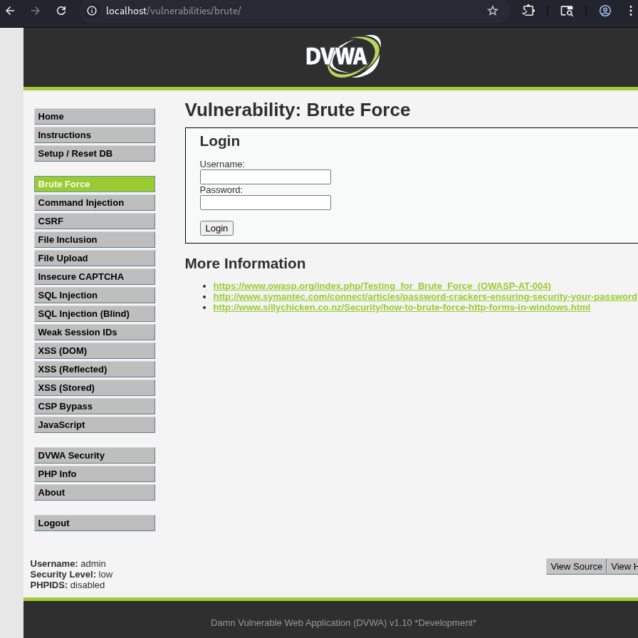
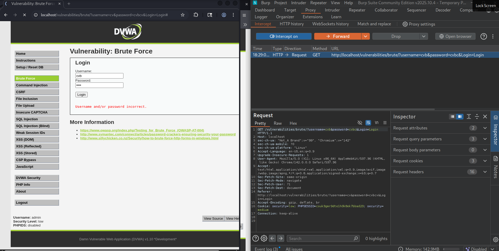
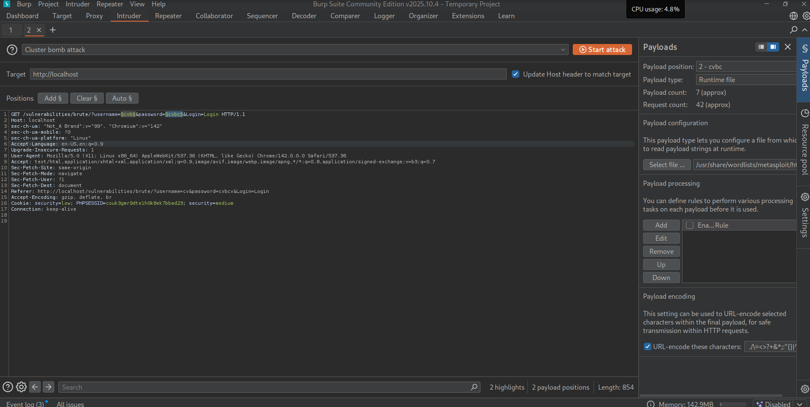
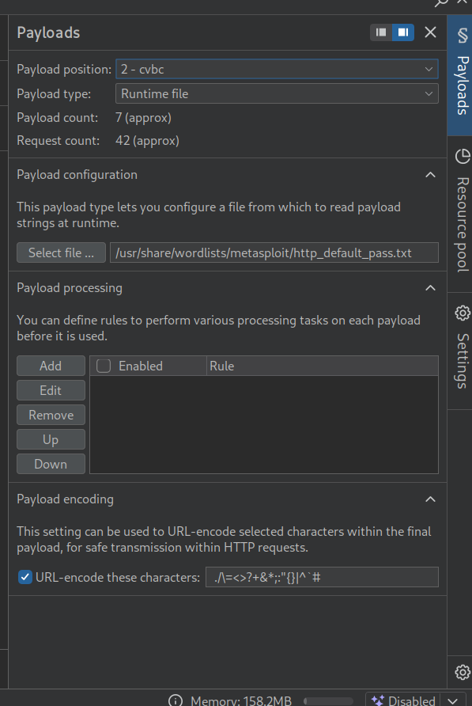
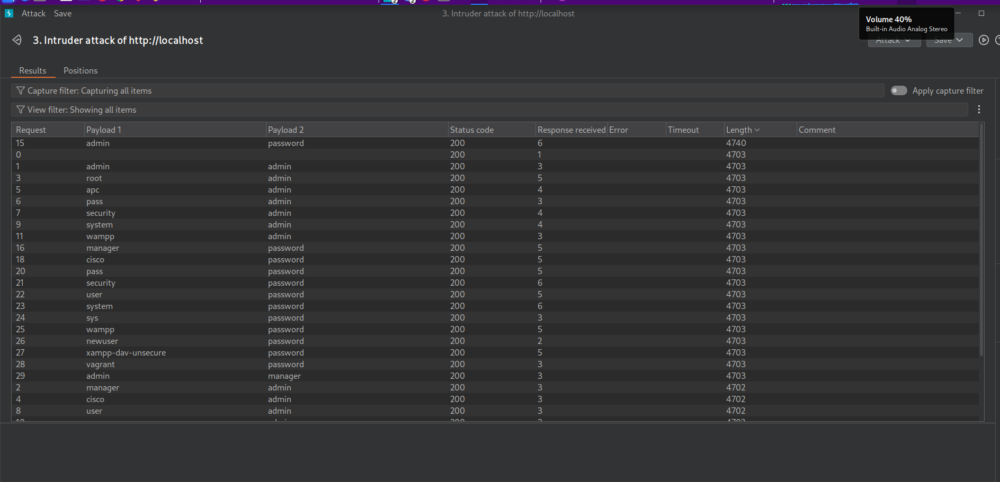
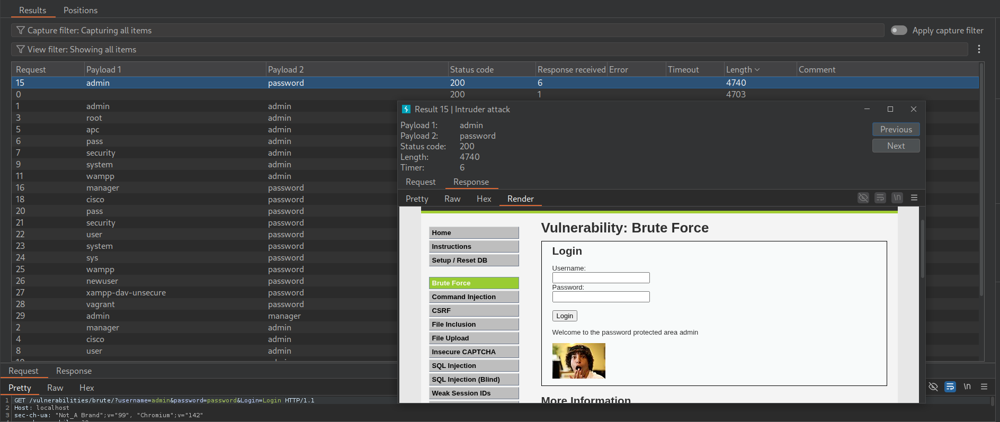

# Vulnerabilidad de Fuerza Bruta Documentada

## 🔐 Página de Login



---

## 📋 Análisis del Código Vulnerable

```php
<?php

if( isset( $_GET[ 'Login' ] ) ) {
    // Get username
    $user = $_GET[ 'username' ];

    // Get password
    $pass = $_GET[ 'password' ];
    $pass = md5( $pass );

    // Check the database
    $query  = "SELECT * FROM `users` WHERE user = '$user' AND password = '$pass';";
    $result = mysqli_query($GLOBALS["___mysqli_ston"],  $query ) or die( '<pre>' . ((is_object($GLOBALS["___mysqli_ston"])) ? mysqli_error($GLOBALS["___mysqli_ston"]) : (($___mysqli_res = mysqli_connect_error()) ? $___mysqli_res : false)) . '</pre>' );

    if( $result && mysqli_num_rows( $result ) == 1 ) {
        // Get users details
        $row    = mysqli_fetch_assoc( $result );
        $avatar = $row["avatar"];

        // Login successful
        echo "<p>Welcome to the password protected area {$user}</p>";
        echo "";
    }
    else {
        // Login failed
        echo "<pre><br />Username and/or password incorrect.</pre>";
    }

    ((is_null($___mysqli_res = mysqli_close($GLOBALS["___mysqli_ston"]))) ? false : $___mysqli_res);
}

?>
```

### ⚠️ Vulnerabilidades Identificadas

- **Sin protección contra fuerza bruta**: No hay límite de intentos
- **Sin CAPTCHA**: Permite automatización de ataques
- **Sin rate limiting**: Se pueden hacer múltiples peticiones sin restricción
- **Respuesta predecible**: Mensaje de error genérico facilita enumeración

---

## 🔍 Proceso de Explotación con Burp Suite

### Paso 1: Interceptar la Petición

Capturamos la petición HTTP utilizando el proxy de Burp Suite:



**Detalles de la petición interceptada:**
- Método: GET
- Parámetros: `cualquier cosa` y `cualquier cosa`
- Sin encriptación adicional en transmisión

---

### Paso 2: Configurar el Intruder

Enviamos la petición al **Intruder**, que es el módulo de Burp Suite diseñado para realizar ataques automatizados.



#### Configuración de Posiciones

1. Seleccionar los campos `username` y `password`
2. Hacer clic en **"Add §"** para marcar las posiciones de payload
3. El formato resultante será: `username=§admin§&password=§password§`

---

### Paso 3: Configurar los Payloads

#### 📝 Payload 1 - Lista de Usuarios


- **Payload Position**: 1
- **Payload Type**: Runtime file
- **Archivo**: Lista de nombres de usuario comunes

#### 🔑 Payload 2 - Lista de Contraseñas



- **Payload Position**: 2
- **Payload Type**: Runtime file
- **Archivo**: Diccionario de contraseñas comunes

#### ▶️ Iniciar Ataque

Una vez configurados ambos payloads, hacer clic en **"Start Attack"**

---

## ✅ Análisis de Resultados

### Tabla de Respuestas



#### 🎯 Identificación de Credenciales Válidas

**Indicador clave**: Observar la columna **"Length"** (tamaño de respuesta)

- Las respuestas con mayor tamaño indican un login exitoso
- Esto se debe a que la página de bienvenida contiene más contenido HTML
- Las respuestas fallidas son más cortas (solo el mensaje de error)

**Credenciales encontradas:**
- La fila con mayor `Length` representa el inicio de sesión exitoso
- Esta diferencia de tamaño es el indicador principal de éxito

---

### Verificación de Resultados



#### Confirmación Manual

1. Hacer **doble clic** sobre la petición con mayor tamaño
2. Revisar el contenido de la respuesta HTTP
3. Verificar que contenga el mensaje: `"Welcome to the password protected area"`
4. Comprobar que se muestre la imagen del avatar del usuario

**Estado**: ✅ **Credenciales válidas confirmadas**

---

## 🛡️ Recomendaciones de Seguridad

### Mitigación de Fuerza Bruta

1. **Implementar rate limiting**: Limitar intentos por IP/usuario
2. **Agregar CAPTCHA**: Después de 3-5 intentos fallidos
3. **Bloqueo temporal**: Cuenta bloqueada temporalmente tras múltiples fallos
4. **Autenticación multifactor (MFA)**: Capa adicional de seguridad
5. **Logging y alertas**: Monitorear intentos de login sospechosos
6. **Contraseñas robustas**: Política de complejidad de contraseñas
7. **Delay progresivo**: Aumentar tiempo de respuesta tras intentos fallidos

### Mejoras en el Código

```php
// Ejemplo de contador de intentos
session_start();
if (!isset($_SESSION['login_attempts'])) {
    $_SESSION['login_attempts'] = 0;
    $_SESSION['last_attempt'] = time();
}

// Verificar límite de intentos
if ($_SESSION['login_attempts'] >= 5) {
    $time_diff = time() - $_SESSION['last_attempt'];
    if ($time_diff < 300) { // 5 minutos de bloqueo
        die("Demasiados intentos. Intenta en " . (300 - $time_diff) . " segundos.");
    } else {
        $_SESSION['login_attempts'] = 0;
    }
}
```

---

## 📚 Conclusión

Este análisis demuestra cómo un sistema sin protecciones adecuadas contra fuerza bruta puede ser comprometido mediante herramientas automatizadas. La implementación de las medidas de seguridad recomendadas es crucial para proteger sistemas de autenticación en producción.