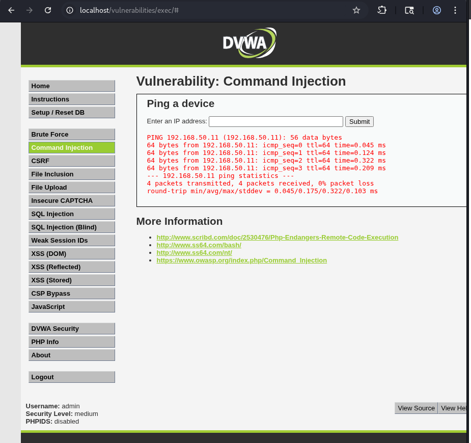
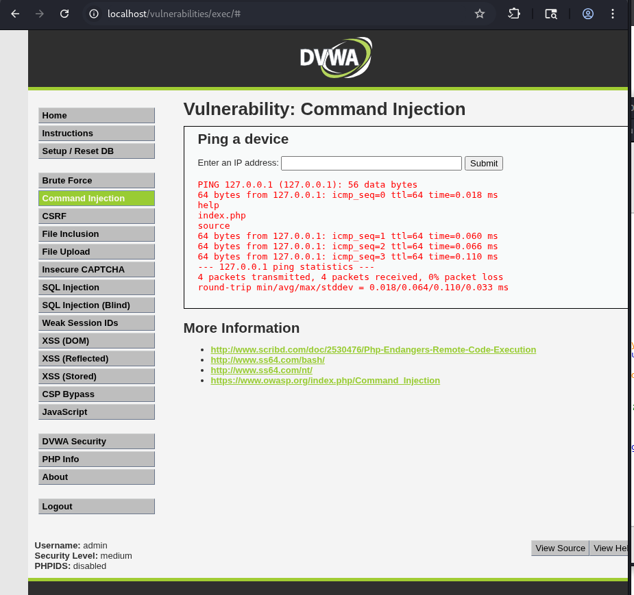

# Vulnerabilidad de Command Injection Documentada

## 🎯 Identificación de la Vulnerabilidad

### Ubicación del Vector de Ataque

La vulnerabilidad se encuentra en la funcionalidad de **"Ping a device"**, que permite la ejecución de comandos del sistema operativo a través del campo de entrada de dirección IP.



**Punto vulnerable identificado:**
- **Campo**: Input de dirección IP
- **Funcionalidad**: Ejecuta comando `ping` en el servidor
- **Riesgo**: Inyección de comandos arbitrarios del sistema

---

## 🔍 Análisis del Código Vulnerable

```php
<?php

if( isset( $_POST[ 'Submit' ]  ) ) {
    // Get input
    $target = $_REQUEST[ 'ip' ];

    // Set blacklist
    $substitutions = array(
        '&&' => '',
        ';'  => '',
    );

    // Remove any of the charactars in the array (blacklist).
    $target = str_replace( array_keys( $substitutions ), $substitutions, $target );

    // Determine OS and execute the ping command.
    if( stristr( php_uname( 's' ), 'Windows NT' ) ) {
        // Windows
        $cmd = shell_exec( 'ping  ' . $target );
    }
    else {
        // *nix
        $cmd = shell_exec( 'ping  -c 4 ' . $target );
    }

    // Feedback for the end user
    echo "<pre>{$cmd}</pre>";
}

?>
```

### ⚠️ Vulnerabilidades en el Código

#### 1. **Lista Negra Incompleta (Blacklist Bypass)**

```php
$substitutions = array(
    '&&' => '',  // Bloqueado
    ';'  => '',  // Bloqueado
);
```

**Problema**: La lista negra solo filtra `&&` y `;`, pero existen otros operadores:

| Operador | Estado | Función |
|----------|--------|---------|
| `&&` | ❌ Bloqueado | Ejecuta comando si el anterior tiene éxito |
| `;` | ❌ Bloqueado | Separa comandos secuenciales |
| `&` | ✅ **Permitido** | Ejecuta comandos en paralelo |
| `|` | ✅ **Permitido** | Pipe - encadena comandos |
| <code>\`</code> | ✅ **Permitido** | Ejecución de subcomandos |
| `$()` | ✅ **Permitido** | Sustitución de comandos |

#### 2. **Uso Inseguro de `shell_exec()`**

- Ejecuta comandos directamente sin validación
- No hay sanitización de entrada
- Concatenación directa de input del usuario

#### 3. **Sin Whitelist**

- No valida que la entrada sea una IP válida
- Acepta cualquier carácter no bloqueado

---

## 💉 Explotación de la Vulnerabilidad

### Payloads Utilizados

```bash
# Listar archivos del directorio actual
127.0.0.1 & ls

# Mostrar directorio de trabajo actual
127.0.0.1 & pwd

# Otros comandos útiles para reconocimiento
127.0.0.1 & whoami          # Usuario actual
127.0.0.1 & cat /etc/passwd # Ver usuarios del sistema
127.0.0.1 & uname -a        # Información del sistema
127.0.0.1 & id              # Identificación del usuario
```

### 🔧 Cómo Funciona el Bypass

**Operador `&` en sistemas Unix/Linux:**
- Ejecuta el comando en **segundo plano**
- El servidor ejecuta: `ping -c 4 127.0.0.1 & ls`
- Resultado: Se ejecutan **ambos comandos**

```bash
# Desglose de la ejecución:
ping -c 4 127.0.0.1    # Comando legítimo
&                       # Operador de background
ls                      # Comando inyectado ✅
```

---

## ✅ Resultados de la Explotación

### Comando: `127.0.0.1 & pwd`



**Información obtenida:**
- ✅ Comando ejecutado exitosamente
- 📍 Directorio actual: `/var/www/html/vulnerabilities/exec`
- 🔓 Confirmación de ejecución de comandos arbitrarios

### Comando: `127.0.0.1 & ls`


**Información obtenida:**
- ✅ Listado de archivos del servidor
- 📂 Estructura de directorios expuesta
- 🎯 Vectores adicionales identificados

---

## 🛡️ Recomendaciones de Seguridad

### 1. **Validación con Whitelist**

```php
// ✅ CORRECTO: Validar formato de IP
function validateIP($ip) {
    return filter_var($ip, FILTER_VALIDATE_IP) !== false;
}

if (!validateIP($target)) {
    die("Dirección IP inválida");
}
```

### 2. **Escapar Argumentos de Shell**

```php
// ✅ CORRECTO: Usar escapeshellarg()
$target = escapeshellarg($_REQUEST['ip']);
$cmd = shell_exec("ping -c 4 $target");
```

### 3. **Usar Funciones Seguras**

```php
// ✅ MEJOR: Evitar shell_exec() completamente
function pingHost($ip) {
    if (!filter_var($ip, FILTER_VALIDATE_IP)) {
        return "IP inválida";
    }
    
    // Usar exec() con array de argumentos
    $output = [];
    $return_var = 0;
    exec("ping -c 4 " . escapeshellarg($ip), $output, $return_var);
    
    return implode("\n", $output);
}
```

### 4. **Implementar Restricciones**

```php
// ✅ Limitar a IPs privadas o específicas
function isAllowedIP($ip) {
    $allowed_ranges = [
        '192.168.0.0/16',
        '10.0.0.0/8',
        '127.0.0.0/8'
    ];
    
    foreach ($allowed_ranges as $range) {
        if (ipInRange($ip, $range)) {
            return true;
        }
    }
    return false;
}
```

### 5. **Usar Librerías Nativas**

```php
// ✅ ÓPTIMO: Usar sockets en lugar de comandos shell
function pingWithSocket($host, $timeout = 1) {
    $socket = @fsockopen($host, 80, $errno, $errstr, $timeout);
    if ($socket) {
        fclose($socket);
        return true;
    }
    return false;
}
```

---

## 🔒 Código Mejorado y Seguro

```php
<?php

if (isset($_POST['Submit'])) {
    $target = $_REQUEST['ip'];
    
    // 1. Validación estricta de formato IP
    if (!filter_var($target, FILTER_VALIDATE_IP)) {
        echo "<pre>Error: Dirección IP inválida</pre>";
        exit;
    }
    
    // 2. Verificar si es IP privada (opcional)
    if (!filter_var($target, FILTER_VALIDATE_IP, FILTER_FLAG_NO_PRIV_RANGE)) {
        echo "<pre>Error: Solo se permiten IPs privadas</pre>";
        exit;
    }
    
    // 3. Escapar el argumento
    $safe_target = escapeshellarg($target);
    
    // 4. Limitar el comando con parámetros seguros
    $command = "ping -c 4 -W 2 $safe_target 2>&1";
    
    // 5. Ejecutar con límite de tiempo
    $descriptorspec = array(
        0 => array("pipe", "r"),
        1 => array("pipe", "w"),
        2 => array("pipe", "w")
    );
    
    $process = proc_open($command, $descriptorspec, $pipes);
    
    if (is_resource($process)) {
        // Timeout de 10 segundos
        $timeout = 10;
        $start = time();
        
        stream_set_blocking($pipes[1], 0);
        $output = '';
        
        while ((time() - $start) < $timeout) {
            $output .= fread($pipes[1], 8192);
            $status = proc_get_status($process);
            if (!$status['running']) break;
            usleep(100000);
        }
        
        fclose($pipes[0]);
        fclose($pipes[1]);
        fclose($pipes[2]);
        proc_close($process);
        
        echo "<pre>" . htmlspecialchars($output) . "</pre>";
    }
}

?>
```

---

## 📊 Comparativa de Seguridad

| Aspecto | Código Vulnerable | Código Seguro |
|---------|------------------|---------------|
| **Validación** | ❌ Solo blacklist | ✅ Whitelist + validación IP |
| **Escapado** | ❌ Ninguno | ✅ `escapeshellarg()` |
| **Operadores** | ❌ Bypass con `&` | ✅ Argumentos aislados |
| **Timeout** | ❌ Sin límite | ✅ Límite de 10 segundos |
| **Output** | ❌ Directo | ✅ `htmlspecialchars()` |
| **Rango IP** | ❌ Cualquiera | ✅ Solo privadas (opcional) |

---

## 🎓 Lecciones Aprendidas

### ❌ **NUNCA hacer:**
1. Confiar solo en listas negras (blacklists)
2. Concatenar entrada de usuario directamente en comandos shell
3. Usar `shell_exec()` sin validación
4. Asumir que filtrar algunos caracteres es suficiente

### ✅ **SIEMPRE hacer:**
1. Validar con listas blancas (whitelists)
2. Usar funciones de escape específicas para shell
3. Considerar alternativas a ejecución de comandos
4. Implementar múltiples capas de validación
5. Limitar permisos del usuario que ejecuta el script
6. Registrar (log) todos los intentos de ejecución

---

## 🚨 Impacto de la Vulnerabilidad

### Severidad: **CRÍTICA** 🔴

**Posibles consecuencias:**
- 💀 Ejecución remota de código (RCE)
- 📂 Acceso a archivos del sistema
- 🔑 Obtención de credenciales
- 🗃️ Lectura de bases de datos
- 🌐 Pivoting a otros sistemas de la red
- 📤 Exfiltración de datos sensibles
- 🔧 Instalación de backdoors

---

## 📚 Referencias y Recursos Adicionales

### Documentación Oficial
- [OWASP - Command Injection](https://owasp.org/www-community/attacks/Command_Injection)
- [PHP Manual - escapeshellarg()](https://www.php.net/manual/es/function.escapeshellarg.php)
- [CWE-77: Command Injection](https://cwe.mitre.org/data/definitions/77.html)

### Operadores de Shell Peligrosos
```bash
;   # Separador de comandos
&   # Ejecución en background
&&  # Ejecución condicional (AND)
|   # Pipe
||  # Ejecución condicional (OR)
`   # Sustitución de comandos (backticks)
$() # Sustitución de comandos
>   # Redirección de salida
<   # Redirección de entrada
\n  # Nueva línea (puede separar comandos)
```

---

## ✅ Conclusión

Esta vulnerabilidad demuestra por qué las **listas negras son insuficientes** para la seguridad. Un único carácter olvidado (`&`) permitió la ejecución completa de comandos arbitrarios en el servidor.

**Principios clave:**
- 🎯 **Validación positiva**: Define qué ES válido, no qué NO es válido
- 🔒 **Defensa en profundidad**: Múltiples capas de seguridad
- 🛠️ **Mínimo privilegio**: Ejecuta con los mínimos permisos necesarios
- 📝 **Auditoría**: Registra y monitorea todas las ejecuciones

La seguridad efectiva requiere **validación exhaustiva** y el uso de **funciones seguras por diseño**, no parches superficiales sobre código inseguro.