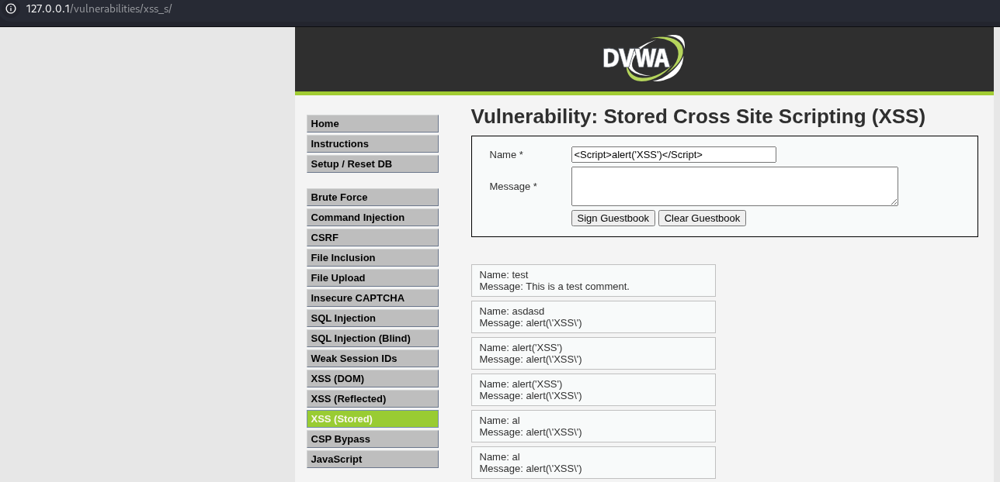
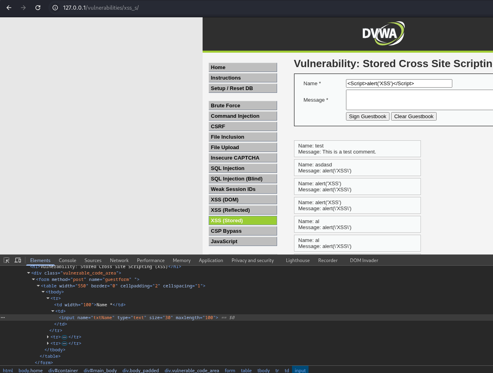
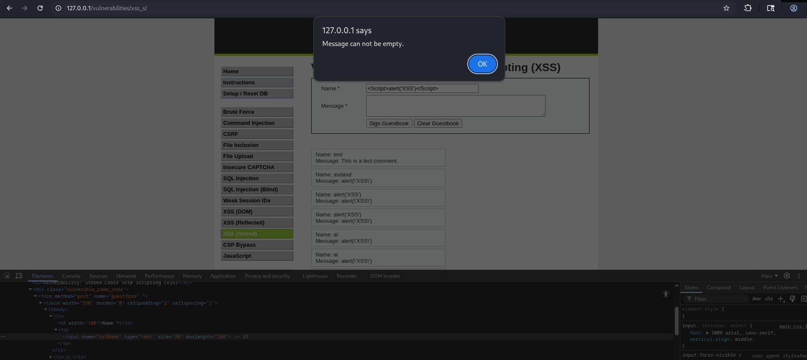

# Vulnerabilidad: Stored Cross-Site Scripting (XSS)

## 📍 Ubicación de la Vulnerabilidad

La vulnerabilidad de XSS almacenado fue identificada en el campo de nombre del formulario de la aplicación web.



---

## 🔍 Análisis y Vectores de Ataque

Durante el análisis de seguridad, se probaron diferentes vectores de ataque XSS. El payload utilizado fue:

```html
<script>alert('XSS')</script>
```

### Proceso de Explotación

1. **Primera prueba**: Se intentó inyectar el payload en el campo de mensaje, sin éxito.
2. **Segunda prueba**: Se identificó que el campo de nombre era vulnerable.
3. **Bypass de validación**: El campo limitaba la entrada a 10 caracteres mediante validación del lado del cliente.

---

## 🛠️ Técnica de Bypass

Para eludir la restricción de longitud del campo de nombre:

1. Abrir las **Herramientas de Desarrollador** del navegador (F12)
2. Inspeccionar el elemento del campo de nombre
3. Modificar el atributo `maxlength` de 10 a 100 caracteres
4. Inyectar el payload XSS completo
5. Enviar el formulario



---

## ✅ Evidencia de Explotación

La siguiente imagen demuestra la ejecución exitosa del código JavaScript inyectado, confirmando la vulnerabilidad de Stored XSS:



---

## 🔒 Recomendaciones de Seguridad

### Para Desarrolladores

1. **Validación del lado del servidor**: Implementar validaciones estrictas en el backend, no solo en el frontend.

2. **Sanitización de entrada**: 
   - Filtrar y escapar todos los caracteres especiales HTML (`<`, `>`, `"`, `'`, `&`)
   - Usar funciones nativas del framework para escapar HTML

3. **Codificación de salida**:
   - Aplicar codificación contextual al mostrar datos del usuario
   - Usar funciones como `htmlspecialchars()` en PHP o equivalentes en otros lenguajes

4. **Content Security Policy (CSP)**:
   - Implementar headers CSP para restringir la ejecución de scripts inline
   - Ejemplo: `Content-Security-Policy: default-src 'self'; script-src 'self'`

5. **Uso de frameworks seguros**:
   - Utilizar frameworks modernos que escapen HTML automáticamente (React, Vue, Angular)

### Nivel de Riesgo

- **Severidad**: Alta
- **Impacto**: Robo de cookies de sesión, phishing, redirección maliciosa, keylogging
- **CVSS Score**: 7.1 (Alto)

### Prioridad de Remediación

**Crítica** - Esta vulnerabilidad debe corregirse inmediatamente ya que permite la ejecución de código malicioso que afecta a todos los usuarios que visualicen el contenido inyectado.

---

## 📚 Referencias

- [OWASP XSS Prevention Cheat Sheet](https://cheatsheetseries.owasp.org/cheatsheets/Cross_Site_Scripting_Prevention_Cheat_Sheet.html)
- [CWE-79: Improper Neutralization of Input During Web Page Generation](https://cwe.mitre.org/data/definitions/79.html)
- [OWASP Top 10 - A03:2021 Injection](https://owasp.org/Top10/A03_2021-Injection/)

---
