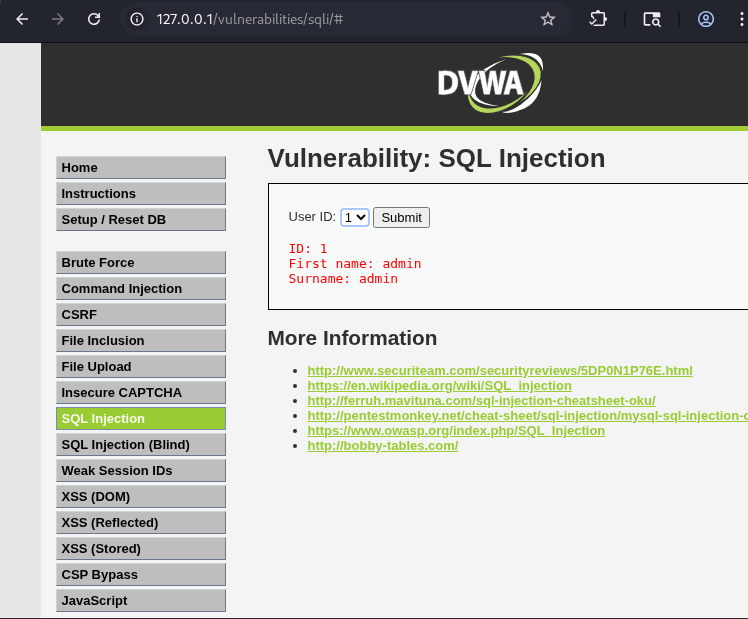
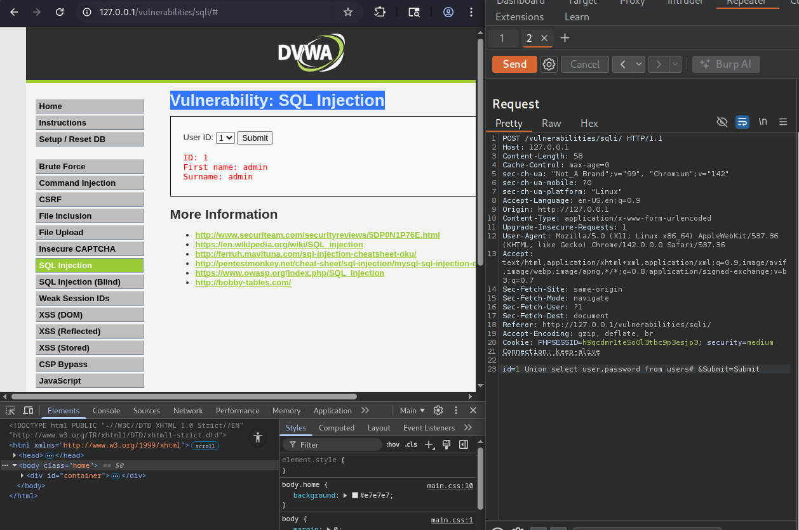
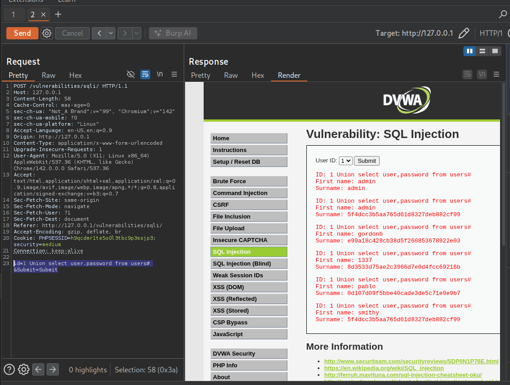

# Vulnerabilidad: SQL Injection

## 📍 Ubicación de la Vulnerabilidad

La vulnerabilidad de inyección SQL fue identificada en un campo de selección (combobox) de la aplicación web. Aunque el campo no permite escritura directa, es posible manipular la petición HTTP.



---

## 🔍 Análisis de la Vulnerabilidad

### Contexto

El formulario implementa un campo de selección (dropdown) que restringe la entrada del usuario a opciones predefinidas. Sin embargo, esta validación solo existe en el lado del cliente, permitiendo la manipulación de parámetros mediante:

- **Inspección de elementos del navegador**
- **Interceptación con proxy (Burp Suite, OWASP ZAP)**

En este caso, se utilizó **Burp Suite** para interceptar y modificar la petición HTTP.

---

## 🛠️ Proceso de Explotación

### Paso 1: Configuración del Proxy

1. Configurar el navegador para usar Burp Suite como proxy
2. Activar la interceptación de peticiones en Burp Suite

### Paso 2: Interceptar la Petición

1. Enviar el formulario con un valor legítimo
2. Capturar la petición HTTP en Burp Suite
3. Identificar el parámetro vulnerable (`id`)

### Paso 3: Inyección SQL

Modificar el parámetro `id` con el siguiente payload:

```sql
id=1 UNION SELECT user,password FROM users#&Submit=Submit
```

**Explicación del payload:**
- `1 UNION SELECT` - Combina la consulta original con una consulta personalizada
- `user,password` - Columnas específicas a extraer
- `FROM users` - Tabla objetivo que contiene credenciales
- `#` - Comentario SQL que anula el resto de la consulta original



---

## ✅ Evidencia de Explotación

La inyección SQL fue exitosa, permitiendo extraer información sensible de la base de datos:

- **Usuarios del sistema**
- **Contraseñas (posiblemente hasheadas o en texto plano)**



---

## 🔒 Recomendaciones de Seguridad

### Mitigaciones Críticas

#### 1. Consultas Preparadas (Prepared Statements)

**PHP con PDO:**
```php
$stmt = $pdo->prepare("SELECT * FROM products WHERE id = ?");
$stmt->execute([$id]);
```

**Python con SQLite:**
```python
cursor.execute("SELECT * FROM products WHERE id = ?", (id,))
```

**Java con JDBC:**
```java
PreparedStatement stmt = conn.prepareStatement("SELECT * FROM products WHERE id = ?");
stmt.setInt(1, id);
```

#### 2. Procedimientos Almacenados

Utilizar stored procedures que limiten las operaciones SQL permitidas.

#### 3. Validación de Entrada

- Validar **tipo de dato** esperado (entero, string, etc.)
- Implementar **whitelist** de valores permitidos
- Validar en el **servidor**, nunca confiar en validaciones del cliente

#### 4. Principio de Menor Privilegio

- La cuenta de base de datos de la aplicación **NO** debe tener permisos de:
  - `DROP`, `CREATE`, `ALTER` (DDL)
  - Acceso a tablas sensibles como `users`
- Usar cuentas con permisos de solo lectura cuando sea posible

#### 5. Escapado de Caracteres

Como última línea de defensa (no como solución principal):

```php
// PHP
$id = mysqli_real_escape_string($conn, $_POST['id']);

// Python
id = connection.escape_string(user_input)
```

#### 6. Web Application Firewall (WAF)

Implementar reglas para detectar patrones de SQLi:
- `UNION SELECT`
- `OR 1=1`
- Comentarios SQL (`--`, `#`, `/**/`)

#### 7. Cifrado de Contraseñas

Si las contraseñas se almacenan en texto plano (como sugiere la evidencia):

- **Usar bcrypt, Argon2 o PBKDF2** para hashear contraseñas
- **Nunca almacenar contraseñas en texto plano**
- Implementar **salt** único por usuario

```php
// PHP - Ejemplo correcto
$hash = password_hash($password, PASSWORD_BCRYPT);
```

---

## 📊 Evaluación de Riesgo

| Aspecto | Valoración |
|---------|-----------|
| **Severidad** | Crítica |
| **CVSS Score** | 9.8 (Crítico) |
| **Impacto** | Acceso total a la base de datos |
| **Explotabilidad** | Alta (no requiere autenticación) |
| **Datos comprometidos** | Credenciales de usuarios, datos sensibles |

### Prioridad de Remediación

**CRÍTICA - INMEDIATA** 

Esta vulnerabilidad permite:
- ✗ Extracción completa de la base de datos (data breach)
- ✗ Robo de credenciales de usuarios
- ✗ Modificación o eliminación de datos
- ✗ Ejecución de comandos del sistema (en configuraciones inseguras)
- ✗ Escalación de privilegios

---

## 🧪 Vectores de Ataque Adicionales

Otras técnicas de SQLi que podrían probarse:

```sql
-- Boolean-based blind SQLi
id=1 AND 1=1

-- Time-based blind SQLi
id=1 AND SLEEP(5)

-- Error-based SQLi
id=1 AND (SELECT 1 FROM (SELECT COUNT(*),CONCAT((SELECT version()),FLOOR(RAND(0)*2))x FROM information_schema.tables GROUP BY x)y)

-- Stacked queries
id=1; DROP TABLE users--
```

---

## 📚 Referencias

- [OWASP SQL Injection](https://owasp.org/www-community/attacks/SQL_Injection)
- [OWASP Top 10 - A03:2021 Injection](https://owasp.org/Top10/A03_2021-Injection/)
- [CWE-89: SQL Injection](https://cwe.mitre.org/data/definitions/89.html)
- [SQL Injection Prevention Cheat Sheet](https://cheatsheetseries.owasp.org/cheatsheets/SQL_Injection_Prevention_Cheat_Sheet.html)
- [PortSwigger SQL Injection](https://portswigger.net/web-security/sql-injection)

