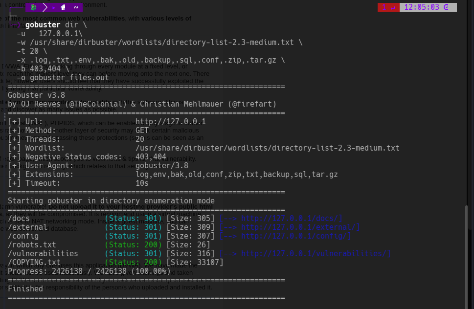

# Comados y Evidencias de Seguridad Web

## Primero analisamos las rutas\
Esto se da mucho por el mal manejo de roles y privilegios.
### Comando  gobuster dir

```bash
gobuster dir \     
  -u   127.0.0.1\
  -w /usr/share/dirbuster/wordlists/directory-list-2.3-medium.txt \
  -t 20 \
  -x .log,.txt,.env,.bak,.old,.backup,.sql,.conf,.zip,.tar.gz \
  -b 403,404 \
  -o gobuster_files.out

```
>

#### Comando dirsearch
```bash
dirsearch -u 127.0.0.1 
```
>


# INgresamos con las credenciales dadas 
```bash
admin   
password
```

>Aqui podemos ver las diferentes vulnerabilidades seccionadas donde podemos explotarlas.
---
# Analisis 
Ok en este punto no debemos analisar todo las expuestas ya que estamos en etapada de analisis es importnte antes sacar toda la informacion posible ya que podriamos estar atacando o buscando en lugares incorrectos y perdernos ahi sin ninguna pista de nada.

